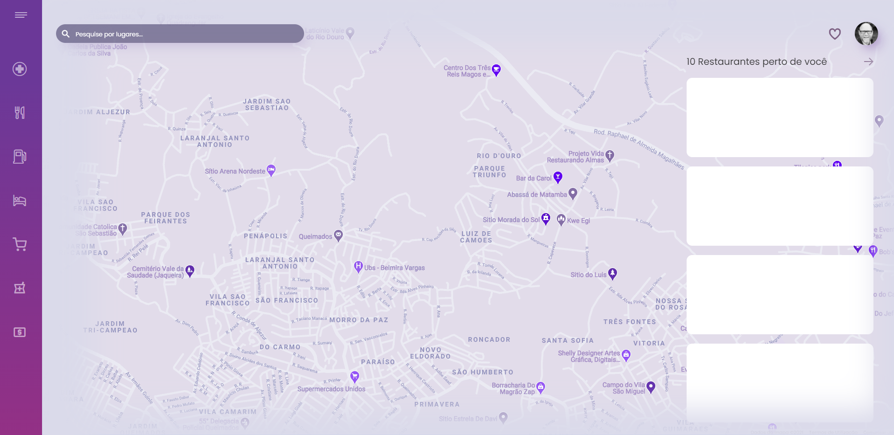
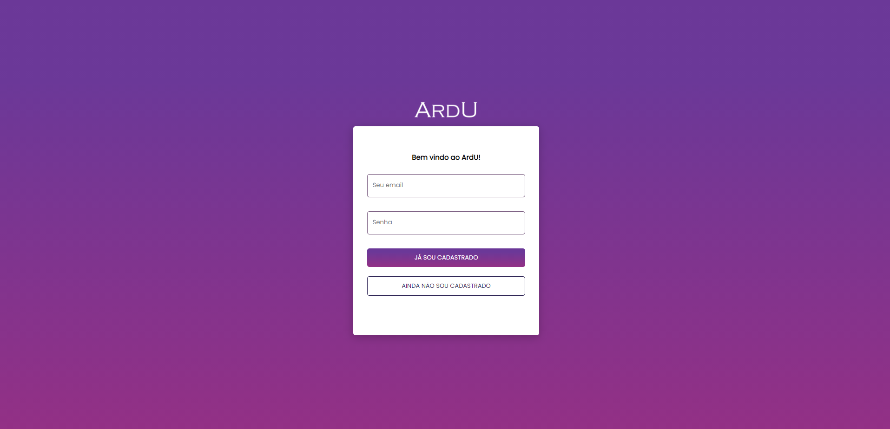

# ArdU Maps
### Aplicação desenvolvida com ReactJS v17.0.1


Desenvolvimento de uma aplicação de mapas que é possível exiber e pesquisar os locais próximos, assim como as avaliações. 

### Home



### Login / Register



### Ajustes e melhorias

O projeto ainda está em desenvolvimento e as próximas atualizações serão voltadas nas seguintes tarefas:

- [x] Tela de login / registro
- [x] Integração com a API https://reqres.in/
- [x] Editar Informaões / Logout
- [x] Integrar com API Google Maps / Places
- [x] Exibir Locais próximos no mapa
- [ ] Lista de locais próximos
- [ ] Salvar em favoritos
- [ ] Avaliar locais

## Iniciando o ArdU
- Clone o repositório 
- Dentro da pasta clonada rode o commando
```
npm install
```
- finalizada a instalação, edite o arquivo `example.env.local` para `env.local` e insira o token do google API
- rode o comando
```
npm start
```
- Para logar, pode usar o usuário de testes 
```
email: eve.holt@reqres.in
senha: cityslicka
```

## Libs Utilizadas

Aqui estão as libs que foram utilizadas neste projeto:

* redux
* node-sass
* sweetalert2
* normalize.css
* react-hook-form `<@hookform/resolvers & yup>`

## Responsavel

<table>
  <tr>
    <td align="center">
      <a href="#">
        <br>
        <sub>
          <b>Erick Ferreira</b>
        </sub>
      </a>
    </td>
  </tr>
</table>


